<p align="center">
  
</p>

# NutriTrack

**Small steps. Every day.** Aplicativo de acompanhamento alimentar para registrar refeições, visualizar o consumo diário e acompanhar metas pessoais.

MVP **apenas frontend**, em React Native + Expo Dev Client. Não possui login, Supabase ou backend. Nome, metas e registros ficam no aparelho via AsyncStorage. A interface inicial está em inglês, com tema claro.

[Design no Figma](https://www.figma.com/design/ypPFuD7Ldwf1VYIZo0DuED) · [Contrato de engenharia](docs/MOBILE_ENGINEERING.md) · [Estado da implementação](docs/IMPLEMENTATION_STATUS.md)

## Funcionalidades

| Área        | Disponível nesta versão                                                                    |
| ----------- | ------------------------------------------------------------------------------------------ |
| Entrada     | Welcome sem conta; conclusão do onboarding salva localmente                                |
| Today       | Diário inicialmente vazio, navegação entre dias, calorias e macros derivados dos registros |
| Busca       | Filtro por nome em três alimentos demonstrativos                                           |
| Registro    | Quantidade por porção e escolha entre Breakfast, Lunch, Dinner e Snack                     |
| Confirmação | Sucesso exibido somente após salvar                                                        |
| Detalhes    | Consulta e exclusão de uma refeição com confirmação                                        |
| History     | Lista dos últimos sete dias e média dos dias anteriores com registros                      |
| Foods       | Catálogo demonstrativo; ainda não é uma biblioteca pessoal                                 |
| Settings    | Nome opcional local e metas de calorias/macros editáveis                                   |
| Estados     | Carregamento, vazio, erros de leitura/gravação, retry e prevenção de envio duplicado       |

**Fluxo principal:** Welcome → Today → Log food → Food details → Meal added → Today atualizado.

O catálogo contém Oatmeal with berries, Grilled chicken salad e Rolled oats. Os valores são ilustrativos, identificados na interface, e não constituem uma base nutricional validada. Nenhuma refeição fictícia é inserida no diário. As metas iniciais também são exemplos editáveis.

Ainda pendentes: edição/desfazer, alimentos próprios, favoritos, gráfico e filtros do histórico. Scanner e receitas ficam fora desta primeira fatia. Não há sincronização, backup remoto ou notificações implementadas.

## Design e telas de referência

A direção visual foi organizada em **13 frames de 390 × 844**, importados no Figma com textos editáveis e formas vetoriais. Página: `0:1`; prancha: `2:11`.

**As imagens abaixo são referências locais do design usado no Figma, não capturas do app executando.** Correspondem à direção 01 disponível em 22/09/2026. O app ainda apresenta diferenças documentadas, especialmente no histórico, no seletor de refeição e nas configurações.

O Figma ainda não tem biblioteca completa de componentes, Auto Layout refinado em todas as telas ou protótipo conectado. A consulta durante a implementação foi bloqueada pelo limite MCP Starter. A comparação remota e a revisão visual completa estão pendentes. O arco de Today recebeu uma correção no Figma que pode não estar refletida no SVG local. Consulte [FIGMA-STATUS.md](design/FIGMA-STATUS.md).

### Entrada e diário

|                                           Welcome · `5:3`                                           |                                             Today · `3:2`                                             |                                      Log food · `5:40`                                       |
| :-------------------------------------------------------------------------------------------------: | :---------------------------------------------------------------------------------------------------: | :------------------------------------------------------------------------------------------: |
| 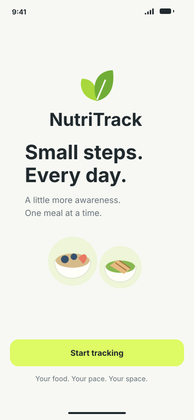 | 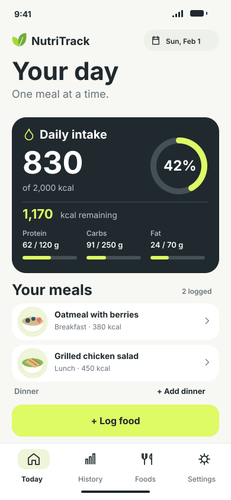 | 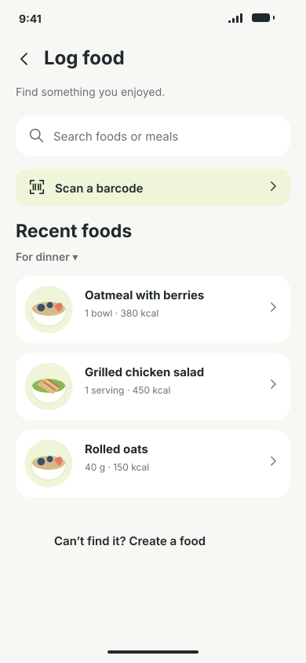 |

### Detalhes e histórico

|                                          Food details · `5:105`                                           |                                        Meal details · `5:152`                                         |                                             History · `5:192`                                             |
| :-------------------------------------------------------------------------------------------------------: | :---------------------------------------------------------------------------------------------------: | :-------------------------------------------------------------------------------------------------------: |
| 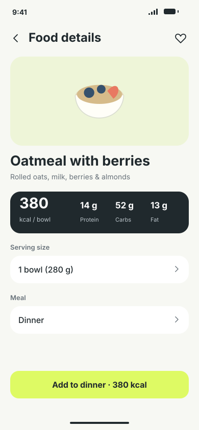 | 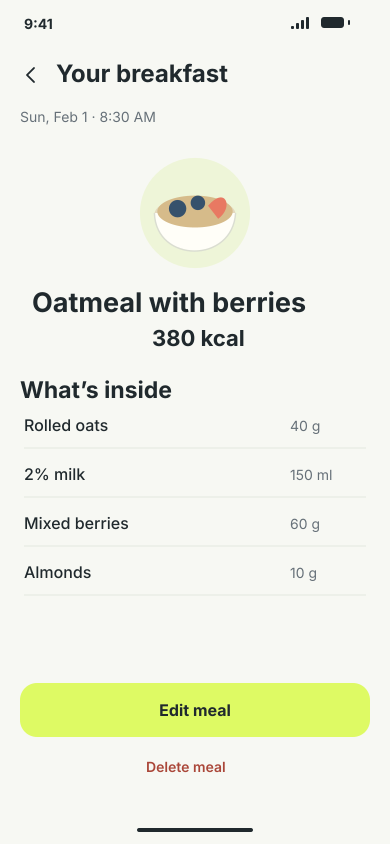 | 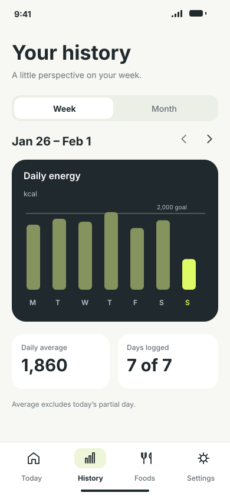 |

### Biblioteca e preferências

|                                       Foods · `5:254`                                        |                                     Settings · `5:320`                                     |                                  Daily targets · `5:386`                                  |
| :------------------------------------------------------------------------------------------: | :----------------------------------------------------------------------------------------: | :---------------------------------------------------------------------------------------: |
| 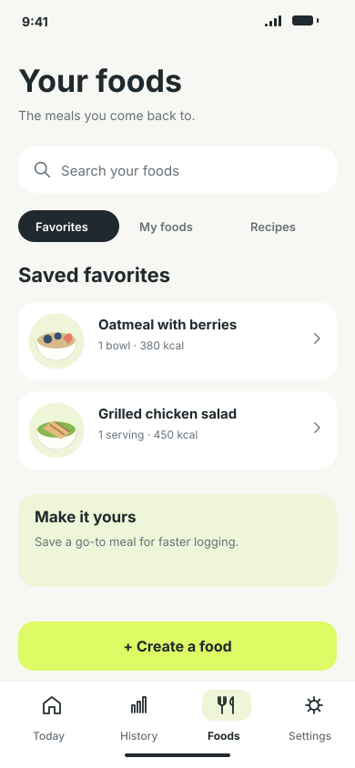 | 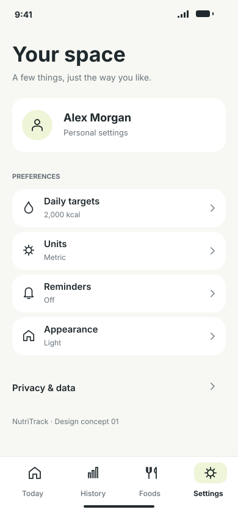 | 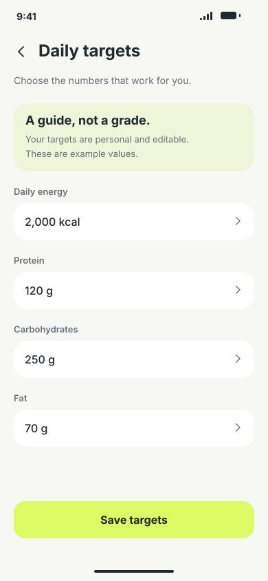 |

### Estados

|                                    Loading · `5:426`                                     |                                  Empty day · `5:469`                                   |                                 Connection error · `5:514`                                 |
| :--------------------------------------------------------------------------------------: | :------------------------------------------------------------------------------------: | :----------------------------------------------------------------------------------------: |
| 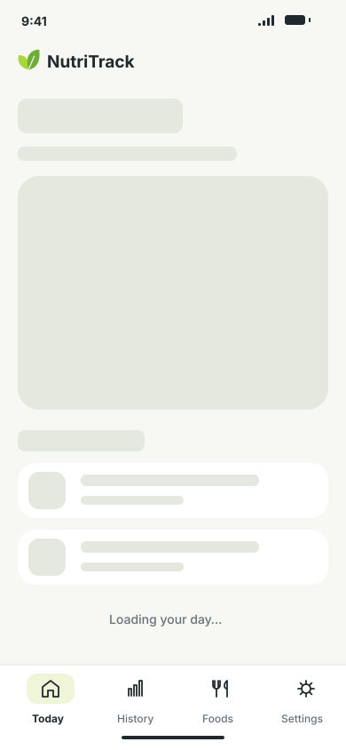 | 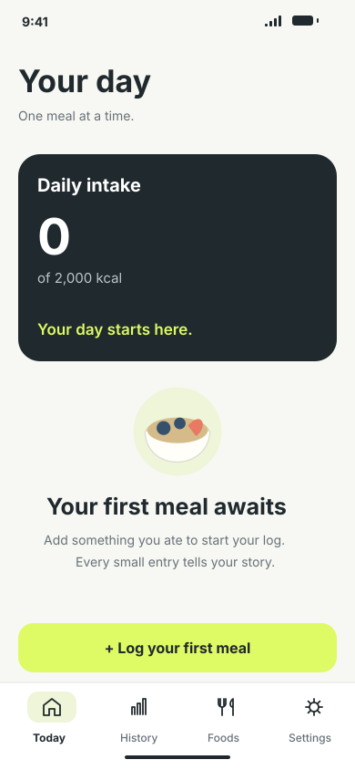 | 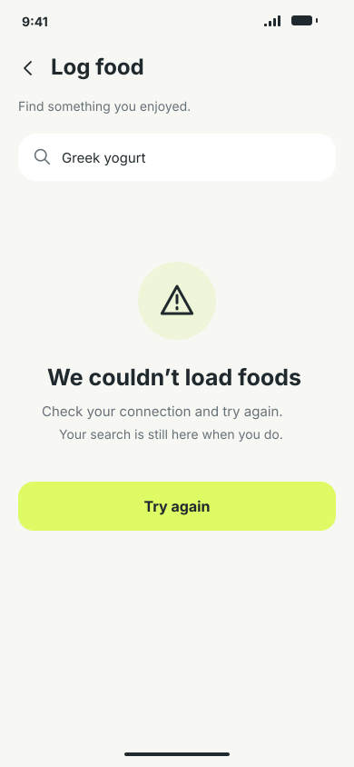 |

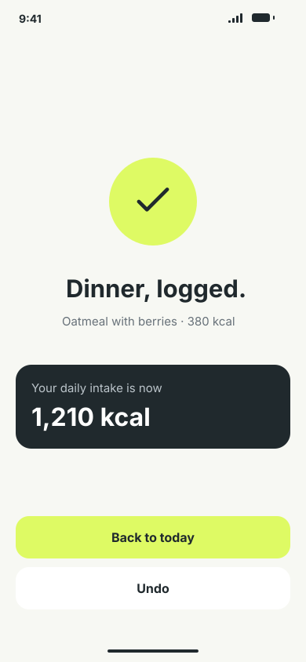

**Meal added · `5:540`.** Loading, vazio, erro e sucesso são estados de fluxo, não quatro rotas públicas independentes. O MVP trata erros locais de armazenamento, sem simular conexão com backend.

### Identidade visual

| Elemento                            | Referência                                                     |
| ----------------------------------- | -------------------------------------------------------------- |
| Fonte                               | Inter: Regular 400, Medium 500, SemiBold 600 e Bold 700 no app |
| Fundo                               | `#F7F8F3`                                                      |
| Texto principal / superfície escura | `#20292D`                                                      |
| Texto secundário                    | `#667078`                                                      |
| Ação principal / progresso          | `#DEFA64`                                                      |
| Superfície suave                    | `#EEF5D8`                                                      |
| Divisórias                          | `#E3E7DF`                                                      |
| Cards                               | `#FFFFFF`                                                      |
| Espaçamentos                        | 4, 8, 12, 16, 20, 24 e 32                                      |
| Raios                               | Controles 12, cards 20, hero 24; botão principal 17            |
| Botão principal                     | Altura mínima 54                                               |
| Layout                              | Flexbox, rolagem e safe areas reais; frame não é tamanho fixo  |

Tokens em [design/tokens.json](design/tokens.json), com mapeamento de runtime em [src/design-system/tokens/index.ts](src/design-system/tokens/index.ts). As cores inversas `#BCC5CB` e `#455054` reproduzem o SVG Today e aguardam confirmação remota.

Para abrir a prancha local:

```bash
node design/serve.cjs
```

Acesse **http://127.0.0.1:4173**. Esse servidor exibe somente as referências de design; não executa o app.

## Stack

Versões declaradas no [package.json](package.json). O [package-lock.json](package-lock.json) fixa a instalação reproduzível.

| Camada             | Tecnologia                                        | Uso                                                       |
| ------------------ | ------------------------------------------------- | --------------------------------------------------------- |
| Plataforma         | Expo `~57.0.24`                                   | SDK, configuração e builds                                |
| App nativo         | React Native `0.86.3`                             | Android e iOS                                             |
| Interface          | React `19.2.3`                                    | Componentes, hooks e Context                              |
| Linguagem          | TypeScript `~6.0.3`                               | Strict, noUncheckedIndexedAccess e alias `@/`             |
| Navegação          | Expo Router `~57.0.22`                            | Rotas por arquivos, stack e abas                          |
| Desenvolvimento    | expo-dev-client `~57.0.19`                        | Development Build                                         |
| Estilos            | StyleSheet + tokens                               | Componentes próprios; sem NativeWind ou UI kit de produto |
| Persistência       | AsyncStorage `2.2.0`                              | Documento local versionado                                |
| Vetores            | react-native-svg `15.15.4`                        | Ícones, ilustrações e arco de progresso                   |
| Tipografia         | expo-font + @expo-google-fonts/inter              | Quatro arquivos de peso reais                             |
| Layout nativo      | safe-area-context + screens                       | Insets e navegação nativa                                 |
| Integrações Expo   | constants, linking, crypto                        | Configuração, links e IDs                                 |
| Aparência          | splash-screen, status-bar, system-ui              | Splash, barras e modo claro                               |
| Ecossistema Router | React DOM, Reanimated e Worklets                  | Dependências alinhadas ao SDK                             |
| Testes             | Jest 29 + jest-expo + Testing Library             | Domínio, armazenamento, hooks e fluxos                    |
| Qualidade          | ESLint, eslint-config-expo, Prettier, Expo Doctor | Análise estática e compatibilidade                        |
| Assets             | Sharp `0.35.4`                                    | SVG → PNG apenas em desenvolvimento                       |
| Automação          | GitHub Actions e EAS                              | CI e perfis de build                                      |

React DOM não significa que uma versão web esteja validada. O alvo é o app nativo com Dev Client. Reanimated e Worklets não introduzem animações adicionais de produto nesta versão.

## Como rodar

### Pré-requisitos

- **Node.js 24** e npm.
- Aparelho ou emulador com Development Build compatível.
- Para compilar Android localmente: Android Studio, Android SDK e JDK compatível. O build registrado usou **JBR 21** do Android Studio.
- Para iOS local: macOS e Xcode. No Windows, usar EAS, com requisitos de conta/assinatura Apple aplicáveis.

O MVP não exige arquivo `.env`, credenciais de Supabase ou backend. A conta EAS é de desenvolvimento, não um login do usuário do aplicativo.

### Instalar dependências

Na pasta do projeto:

```bash
npm ci
```

### Compilar e instalar Android localmente

Com emulador aberto ou aparelho conectado e depuração USB autorizada:

```bash
npm run android
```

Para selecionar um aparelho:

```bash
npm run android -- --device
```

No PowerShell, se o Java padrão estiver incompatível, use o JBR do Android Studio, ajustando o caminho conforme a instalação:

```powershell
$env:JAVA_HOME = 'C:\Program Files\Android\Android Studio\jbr'
npm.cmd run android
```

O script executa `expo run:android`, gera o projeto nativo quando necessário, compila e instala o cliente.

### Iniciar o Metro

Se o cliente já estiver instalado:

```bash
npm start
```

Esse script executa `expo start --dev-client`. Abra o NutriTrack instalado e conecte-o ao servidor exibido no terminal. Em conexão LAN, computador e aparelho precisam estar na mesma rede e ter acesso ao servidor.

Se o PowerShell bloquear `npm.ps1` ou `npx.ps1`, use `npm.cmd` e `npx.cmd`.

### iOS local

Em um Mac preparado:

```bash
npm run ios
```

Não houve validação iOS nesta entrega. **Expo Go não é o alvo de validação.**

### APK local existente

A implementação gerou `artifacts/nutritrack-development-arm64.apk`. Pode existir no workspace original, mas não acompanha um clone, pois binários e `artifacts/` são ignorados pelo Git.

É um **Development Build Android arm64** que depende do Metro. Não é um APK de preview independente.

## Builds com EAS

O perfil de desenvolvimento já existe em [eas.json](eas.json). Para Android na nuvem:

```bash
npx eas-cli@latest login
npx eas-cli@latest build --platform android --profile development
```

Depois de instalar:

```bash
npm start
```

Para iOS via EAS:

```bash
npx eas-cli@latest build --platform ios --profile development
```

O perfil atual não configura `ios.simulator: true`; não presumir que ele gera um build para simulador.

| Perfil      | Configuração                             | Finalidade                                               |
| ----------- | ---------------------------------------- | -------------------------------------------------------- |
| development | developmentClient e distribuição interna | Desenvolver com Metro                                    |
| preview     | Distribuição interna                     | Build de revisão; ainda não validado nesta entrega       |
| production  | autoIncrement                            | Build de produção; não publica automaticamente nas lojas |

Configuração local em [app.config.ts](app.config.ts) e [eas.json](eas.json):

| Campo                                   | Valor                                  |
| --------------------------------------- | -------------------------------------- |
| Projeto                                 | `@igorvtermions/nutritrack`            |
| EAS project ID                          | `325a6cb0-11e9-4349-a7fa-94d25a6c2d5e` |
| Android package / iOS bundle identifier | `com.nutritrack.prototype`             |
| Scheme                                  | `nutritrack`                           |
| Numeração de builds                     | `cli.appVersionSource: remote`         |

É necessário acesso ao projeto EAS configurado. Os identificadores são do protótipo, não identificadores definitivos de publicação aprovados.

Como a configuração é dinâmica, o vínculo é declarado em `extra.eas.projectId` no objeto exportado pelo `app.config.ts`. Não envolver esse objeto em outra chave `expo`.

### Quando reconstruir

Mudanças de TypeScript/JavaScript normalmente usam Metro. Mudanças em módulos nativos, config plugins ou configuração nativa exigem novo build. Para atualizar a geração Android explicitamente:

```bash
npx expo prebuild --platform android --no-install
npm run android
```

O projeto usa **Expo Continuous Native Generation**: `android/` e `ios/` são gerados e ignorados. Mantenha configurações em `app.config.ts`/plugins e preserve alterações manuais existentes. Não usar `prebuild --clean` como solução automática.

### Problemas comuns

| Sintoma                                            | Verificação                                                         |
| -------------------------------------------------- | ------------------------------------------------------------------- |
| EAS não consegue escrever na configuração dinâmica | Conferir extra.eas.projectId e owner no app.config.ts               |
| Nenhum dispositivo encontrado                      | Iniciar AVD ou conectar aparelho com depuração USB autorizada       |
| Erro de Java/Gradle                                | Conferir JAVA_HOME e JDK compatível                                 |
| App não encontra Metro                             | Executar npm start e conferir endereço/rede                         |
| Módulo nativo ausente após instalar pacote         | Gerar e instalar novo Dev Client                                    |
| Erro ao carregar dados                             | Usar retry; o app não sobrescreve conteúdo inválido silenciosamente |
| Logo do splash ausente                             | Conferir assets/images/logo.png e plugin expo-splash-screen         |

## Scripts e qualidade

| Comando                | Ação                                  |
| ---------------------- | ------------------------------------- |
| `npm start`            | Metro com Dev Client                  |
| `npm run android`      | Compilar e executar Android           |
| `npm run ios`          | Compilar e executar iOS               |
| `npm run typecheck`    | TypeScript sem emissão                |
| `npm run lint`         | ESLint, hooks e restrições de imports |
| `npm run format:check` | Verificar formatação                  |
| `npm run format`       | Aplicar Prettier                      |
| `npm test -- --ci`     | Executar testes em série              |
| `npm run doctor`       | Compatibilidade e configuração Expo   |

A [CI](.github/workflows/quality.yml) roda em push/pull request: instala pelo lockfile e executa tipos, lint, formatação e testes. Expo Doctor é separado e pode exigir rede.

Os testes cobrem cálculos nutricionais, datas locais, validação e serialização do armazenamento, falhas de escrita, busca, prevenção de duplicação e integração do registro. Persistência simulada não substitui reabrir o app em um aparelho com AsyncStorage real.

## Estrutura do projeto

```text
.github/workflows/quality.yml   CI de qualidade
assets/images/logo.png         Logo do splash e README
design/
  screens/                     13 referências SVG
  icons/                       Ícones originais
  tokens.json                  Tokens base
  00-foundations.svg           Fundamentos visuais
  screen-map.json              Notas dos fluxos
  FIGMA-STATUS.md               Estado do Figma
  index.html                   Prancha local
  serve.cjs                    Servidor da prancha
  build.cjs                    Gerador dos artefatos de design
docs/
  MOBILE_ENGINEERING.md        Contrato de engenharia
  IMPLEMENTATION_STATUS.md     Evidências e pendências
  decisions/001-local-mvp.md   Decisão de persistência
scripts/
  extract-design-assets.cjs    Extrai SVGs e gera PNG da marca
src/
  app/                         Rotas e layouts Expo Router
  bootstrap/                   Providers, hidratação e dependências
  data/
    fixtures/                  Catálogo demonstrativo
    repositories/              Armazenamento local
  design-system/
    components/                Texto, botão, campo, tela, cabeçalho e erro
    icons/                     Assets extraídos e wrapper SVG
    tokens/                    Cores, fontes, espaçamentos e raios
  domain/nutrition/             Tipos e cálculos puros
  features/
    onboarding/                Welcome
    diary/                     Today, detalhes e contrato do repositório
    food-catalog/              Busca e registro
    history/                   Histórico semanal simples
    settings/                  Nome e metas
  shared/
    date/                      Datas locais
    hooks/                     Controle de envio
AGENTS.md                      Regras do repositório
app.config.ts                  Configuração Expo e vínculo EAS
eas.json                       Perfis de build
eslint.config.js               Regras estáticas
jest.config.js                 Configuração dos testes
tsconfig.json                  Tipagem e alias
package.json                   Scripts e dependências
package-lock.json              Versões resolvidas
.gitignore                     Exclusões de versionamento
.prettierignore                 Exclusões de formatação
.prettierrc.json                Estilo de formatação
```

Testes ficam próximos do código em arquivos `.test.ts`/`.test.tsx`. Projetos nativos, `.expo/`, builds, logs, caches, arquivos de ambiente e credenciais de assinatura não são versionados. Código, assets, design, documentos e lockfile permanecem no Git.

### Rotas e arquitetura

| Rota                       | Responsabilidade                            |
| -------------------------- | ------------------------------------------- |
| src/app/_layout.tsx        | Fontes, splash, provider e stack raiz       |
| src/app/index.tsx          | Welcome ou redirecionamento após hidratação |
| src/app/(tabs)/_layout.tsx | Abas Today, History, Foods e Settings       |
| src/app/food/search.tsx    | Busca preservando a data selecionada        |
| src/app/food/[foodId].tsx  | Detalhe e registro de alimento              |
| src/app/meal/[entryId].tsx | Consulta e exclusão do registro             |
| src/app/targets.tsx        | Metas                                       |

Rotas são adaptadores finos. Telas usam hooks/contexto, domínio puro e contratos de repositório. Componentes visuais não acessam AsyncStorage, SQL ou HTTP. O bootstrap conecta o repositório concreto ao app.

## Dados locais e regras de domínio

O [LocalDiaryRepository](src/data/repositories/LocalDiaryRepository.ts) salva JSON na chave **`nutritrack:diary:v1`**:

| Campo     | Conteúdo                                   |
| --------- | ------------------------------------------ |
| version   | Versão do documento, atualmente 1          |
| onboarded | Entrada inicial concluída                  |
| name      | Nome opcional, sem conta associada         |
| targets   | Calorias, proteína, carboidratos e gordura |
| entries   | Refeições registradas                      |

Uma entrada guarda ID, alimento, descrição, porção, quantidade, refeição, data local, instante de criação, ilustração e **snapshot nutricional consumido**. Mudanças futuras no catálogo não recalculam silenciosamente os registros anteriores.

- Mutações são serializadas para evitar perda de alterações concorrentes.
- Sucesso só é confirmado após salvar.
- Dados inválidos ou versão desconhecida geram erro, sem limpeza automática.
- O documento é versionado; não há migrações entre versões implementadas ainda.
- Quantidades devem ser positivas e finitas; nutrientes e metas não podem ser negativos.
- Escala e soma não fazem arredondamento intermediário.
- O arco limita apenas o progresso visual; o texto informa consumo acima da meta.
- A data local escolhida é separada do instante de criação.
- A média semanal exclui hoje parcial e dias sem registros.

AsyncStorage é persistente local e não oferece criptografia própria. Não há backup nem sincronização implementados. Desinstalar ou limpar os dados pode remover o diário. Não guardar credenciais nesse documento.

## Materiais, assets e convenções

Antes de alterar código, leia [AGENTS.md](AGENTS.md) e [MOBILE_ENGINEERING.md](docs/MOBILE_ENGINEERING.md). Para UI, consulte também [FIGMA-STATUS.md](design/FIGMA-STATUS.md), os tokens e o SVG correspondente.

- Preservar identidade, ícones e ilustrações; não usar a tela inteira como imagem.
- Reutilizar tokens/componentes e separar apresentação, domínio e armazenamento.
- Usar TypeScript estrito, sem any ou supressões para esconder falhas.
- Considerar teclado, safe areas, rolagem, texto ampliado e acessibilidade.
- Implementar ações reais, erros recuperáveis e prevenção de duplicação.
- Não adicionar backend, autenticação ou serviços remotos sem novo escopo.

Para regenerar assets:

```bash
node scripts/extract-design-assets.cjs
npx prettier --write src/design-system/icons/assets.ts
```

O script extrai vetores locais para [assets.ts](src/design-system/icons/assets.ts) e gera [logo.png](assets/images/logo.png) com Sharp. Não redesenha as ilustrações. O PNG está no projeto; não é necessário executar a conversão para rodar o app.

Inter usa licença OFL; Sharp, Apache-2.0; Expo, React Native e as principais bibliotecas, MIT. Consulte os pacotes para os termos completos. O projeto é marcado private no npm e não possui arquivo LICENSE definindo licença própria de distribuição.

Referências técnicas: [Development Builds](https://docs.expo.dev/develop/development-builds/introduction/), [armazenamento](https://docs.expo.dev/develop/user-interface/store-data/) e [versionamento EAS](https://docs.expo.dev/build-reference/app-versions/).

## Validação e próximos passos

Resultados registrados na implementação em **22/09/2026**, não uma nova execução dos testes durante a edição deste README:

| Verificação                               | Resultado registrado                                                            |
| ----------------------------------------- | ------------------------------------------------------------------------------- |
| TypeScript, ESLint e Prettier             | Aprovados                                                                       |
| Testes                                    | 20 aprovados em 6 suítes                                                        |
| Expo Doctor                               | 21/21 aprovados                                                                 |
| Bundle Android                            | Gerado pelo Metro                                                               |
| Development Build Android arm64           | Compilado                                                                       |
| Aparelho e persistência real após reabrir | Pendente                                                                        |
| Comparação visual app/Figma               | Pendente                                                                        |
| Build e teste iOS                         | Pendente                                                                        |
| npm audit                                 | 14 ocorrências moderadas transitivas; nenhuma alta/crítica na rodada registrada |

As correções automáticas sugeridas pelo audit envolviam versões incompatíveis/antigas do SDK; não foi aplicado audit fix --force. Detalhes em [IMPLEMENTATION_STATUS.md](docs/IMPLEMENTATION_STATUS.md).

Próximas etapas:

1. Instalar o Dev Client em Android e validar registro, retorno ao diário e persistência.
2. Comparar as telas com as referências e corrigir diferenças visuais e de acessibilidade.
3. Completar edição/desfazer, alimentos próprios e favoritos.
4. Implementar gráfico e filtros do histórico.
5. Validar iOS e preparar build de demonstração independente.

A existência das 13 referências visuais não significa que todas estejam finalizadas no aplicativo.
